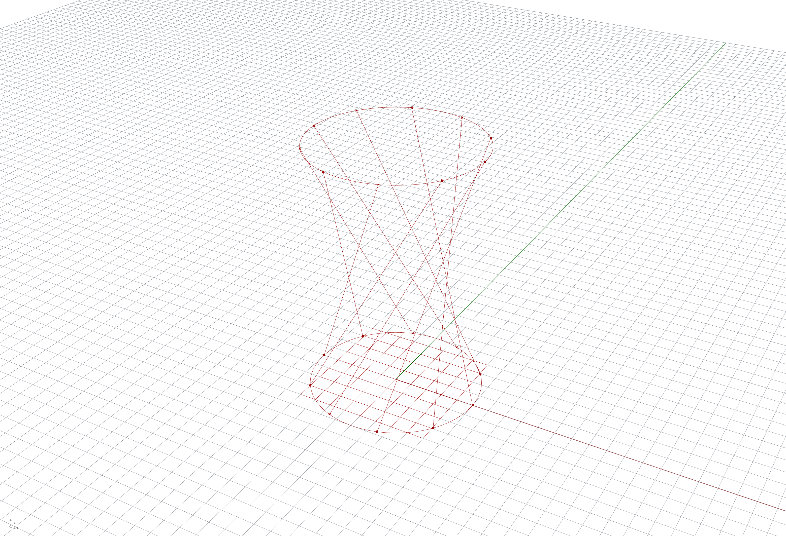

# lines.py

This sample uses [Rhino.Compute](https://developer.rhino3d.com/guides/compute) to solve a grasshopper graph. The inputs for the graph are a curve -- created from a circle in this case, using `rhino3dm` -- and an angle of rotation. The output, a list of lines, is written to a 3DM file.

## macOS

```commandline
$ python3 -m venv venv
$ source venv/scripts/activate
$ pip install rhino3dm compute-rhino3d
$ python lines.py
```

## Windows

```commandline
> py -3 -m venv venv
> .\venv\Scripts\activate
> pip install rhino3dm compute-rhino3d
> python lines.py
```

