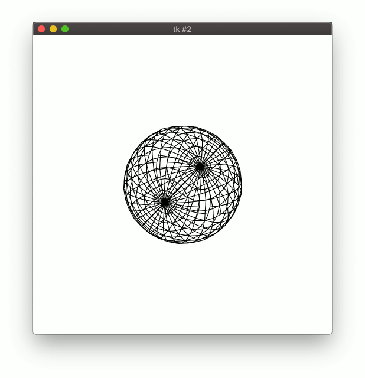

# makemesh.py

This sample uses rhino3dm to create a brep from a sphere and then sends it to Compute to generate a mesh. The resulting mesh is visualised with Python's built-in Tkinter GUI framework.

```commandline
$ python3 -m venv venv
$ source venv/bin/activate
$ pip install rhino3dm compute-rhino3d
$ python makemesh.py
```

